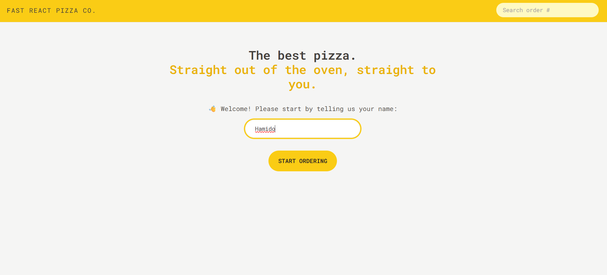
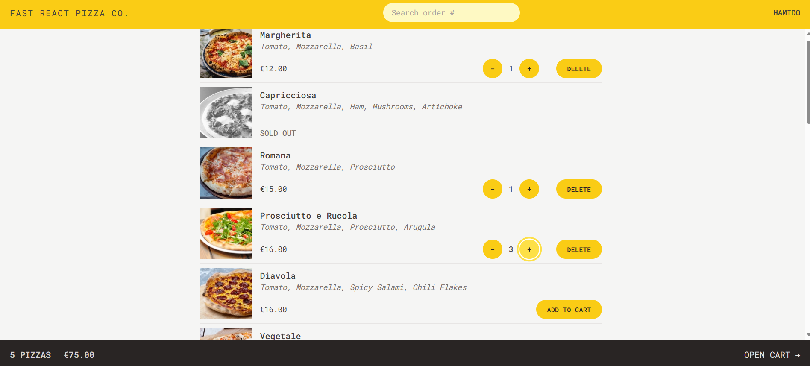
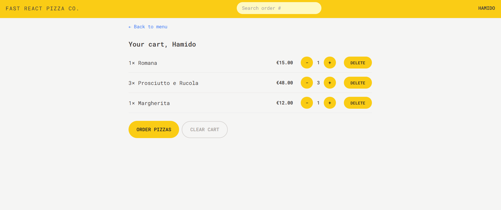
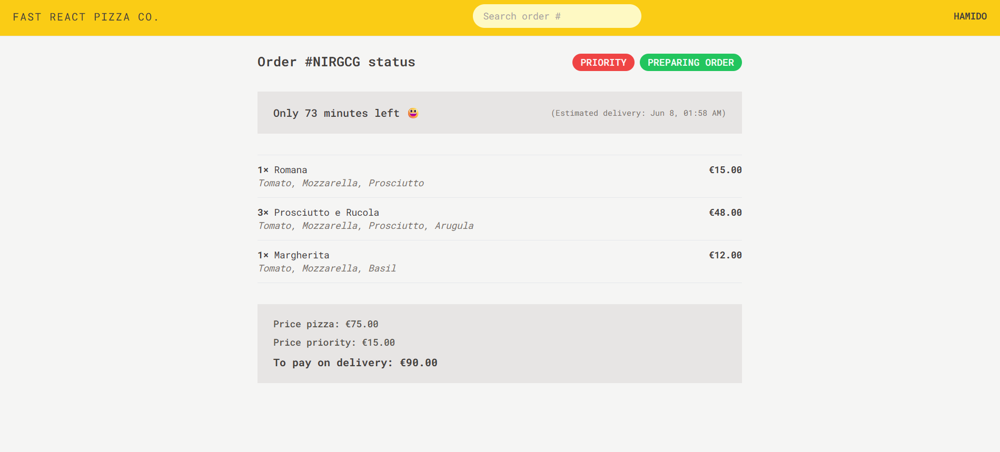

# 🍕 Fast React Pizza

Fast React Pizza is a modern pizza ordering application built with React. Users can browse the menu, add pizzas to their cart, manage quantities, create orders, track existing orders, and use geoLocation to automatically fill their delivery address.

This project was focuses on modern React development patterns, state management with Redux Toolkit, React Router Data APIs, and responsive UI design with Tailwind CSS.

---

## 🚀 Features

- 🍕 Browse pizza menu fetched from an API
- 🛒 Add pizzas to the shopping cart
- ➕ Increase item quantities
- ➖ Decrease item quantities
- ❌ Remove items from the cart
- 🧹 Clear the entire cart
- 📦 Create new orders
- 🔎 Search and track orders by ID
- 📍 Detect user location using the GeoLocation API
- 🌍 Automatically fetch address from coordinates
- 👤 Manage user information with Redux Toolkit
- ⚡ Async state management using createAsyncThunk
- 🔄 Data loading with React Router Loaders
- ✍️ Form handling with React Router Actions
- 🚫 Error handling with Error Elements
- 🚀 Fetch and update data without navigation using useFetcher
- 🎨 Fully styled using Tailwind CSS
- 📱 Responsive design for multiple screen sizes
- 🏗️ Feature-based project architecture

---

## 🛠️ Technologies Used

- React
- React Router
- Redux Toolkit
- createAsyncThunk
- Tailwind CSS
- Vite
- GeoLocation API

---

## 📂 Project Structure

```bash
src/
├── features/
│   ├── cart/
│   ├── menu/
│   ├── order/
│   └── user/
├── services/
├── ui/
├── utils/
├── store.js
└── App.jsx
```

---

## ✨ Main Concepts Practiced

This project helped me practice:

- Redux Toolkit state management
- Creating and managing Redux slices
- Async operations using createAsyncThunk
- React Router Loaders
- React Router Actions
- React Router useFetcher
- Route-based data loading
- Form submissions with React Router
- Global state management
- GeoLocation integration
- Responsive UI development
- Tailwind CSS workflow
- Feature-based application architecture

---

## ⚙️ Installation

Clone the repository:

```bash
git clone https://github.com/YOUR_USERNAME/fast-react-pizza.git
```

Navigate into the project directory:

```bash
cd fast-react-pizza
```

Install dependencies:

```bash
npm install
```

Run the development server:

```bash
npm run dev
```

---

## 📸 Screenshots

### Home Page



### Pizza Menu



### Shopping Cart



### Order Tracking



---

## 📚 What I Learned

Through this project, I improved my understanding of:

- Redux Toolkit and modern Redux patterns
- Async state management with createAsyncThunk
- React Router Data APIs
- Loaders, Actions, and useFetcher
- Managing complex application state
- Working with geoLocation and external APIs
- Building scalable React applications
- Organizing projects using feature-based architecture
- Creating responsive interfaces with Tailwind CSS

---

## 👨‍💻 Author

Muhammed Hamido